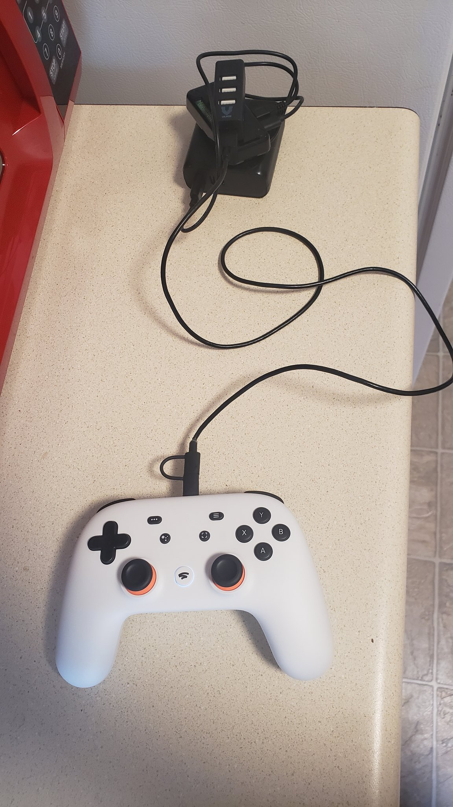
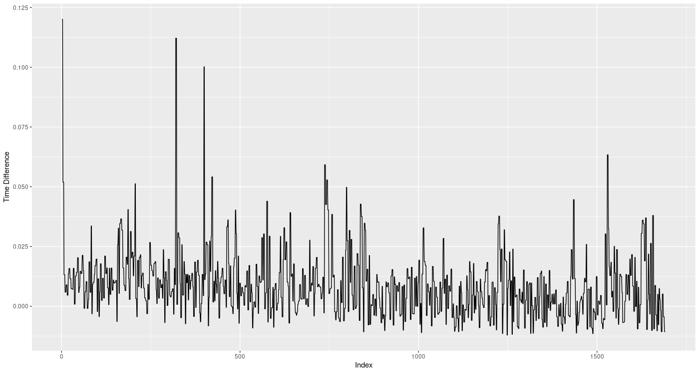

# "bluetooth" Stadia controller
There are a lot of caveats to go over here. Please read the entire readme before starting to use this.

## Requirements
This program only currently works only RPi0 to other Linux based machines, but if any
- RPi0 or similar device with bluetooth capabilities.
- Battery bank
- Cables
    + from battery bank to RPi0 (typically USB A to micro B)
    + A micro B to full size USB A hub
    + A USB A to USB C
- Free time
- Basic linux/python knowledge.

## Installation
### On RPi0
Assuming that you have a basic setup with ssh going;
- Install python bluetooth libraries
    + `pip3 install pybluez`
    + Assuming debian based system:
        * `sudo apt install libbluetooth3`
- Install python evdev
    + `pip3 install evdev`
Then you're going to have to add the `pi` user (by default) to the `input` group.

`sudo usermod -a -G input pi`

Then reboot. This should be all that you need to do.

If you don't want to bother with trouble shooting `input` access issues you can also install the `pip` packages as root and run the program as root.

### On game computer
Follow the same steps as above.

## Usage
Start the server on your game computer;

`python3 btserver.py --cap stadia --all`

Make sure all the things are plugged in on your RPi0

You can check that the Stadia controller is being detected with `evtest`. It should be the only device that shows up.

Start the client on your RPi0;

`python3 btclient.py -d "Google Inc. Stadia Controller"`

They should connect within about 30 seconds. 

You should be good to go!

## Run at boot on RPi0
Normally I would use a simple `cron` job but in my testing it seems like it has some issues with launching before bluetooth is ready.

I followed [this](https://stackoverflow.com/questions/37869423/run-a-script-after-bluetooth-is-configured-and-running-rasperry-pi-3) guide to install the program as a `systemd` service on the RPi0. You can find the file in this repo `stadia.service`

## How can I see what my lag is?
Well this turns out to be a pretty complicated question.

I have provided logs from both my RPi0 and Game Computer, captured by 

`evtest /path/to/device >> eventlog`

for about 3 minutes of me playing SuperMeatBoy without using the triggers or sticks. This output is then filtered by `eventprocessor.py <filename>` to extract data to csv format. The I imported both the remote and local times and events into one spreadsheet and compared the two. Taking the difference between the times feeding that into R for plotting.

note that the "lag" dips into the negative many, many times here. So this leads into questions about the precision of the times between the two computers. These are questions that I am not at all qualified to answer.

Also note that I specified that I only used digital inputs for this data. There is some bottle neck somewhere in the line that make the inputs lag really bad when using the analog features of the controller. I'd wager that this is from the lack of processing power on the RPi0. If you are able to use the analog without lag on a different client device please let me know.

## Limitations
Currently only supports Linux as the remote device. I've been looking around for a input emulation library for windows but none seem to be actively maintained. If you have any suggestions open an issue with a link to the library and I'll look into it. 

Feel free to open a PR if you get something working.

Bluetooth struggles connecting. Not sure if there is even anything to be done about that or if it is just BT being BT.

Lag! It's not zero latency. Not sure what you want. Go bug Google to flip a switch and enable bluetooth functionality on the controllers. 

Like mentioned above the lag comes from using the analog inputs. If you are using this for something like SuperMeatBoy it is honestly service able if you don't use the sticks/triggers.

My RPi0 can't seem to detect that the Stadia controller has rumble so that feature is going to be completely absent. 
